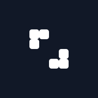

  

    

      
    

    

      

        
      

      

        
      

      

        
Odet.Life

        <article class="prose text-gray-300 max-w-none">
          
Odet Life is a dynamic generative art project based on Conway’s Game of Life

          
Game of Life was not the first cellular automata ever created. John Von Neumann and Stanislaw Ulam discovered them in 1940s and it has been a topic for computer scientist ever since.
        But, Life was the first one to achieve cult status in 1970s. Since then, it has been gateway for generations of programmers. People are still discovering new patterns 50 year
        on. Generations have been awestruck with Life’s lesson - How simplicity can give birth to such magnificent complexity.

          
John Horton Conway - created a zero player simulation game, which he called “life” because of its analogies to rise, fall
        and alternations of societies of living organisms. Conway designed the rules of the game to ensure unpredictable nature of population’s behaviour.

          
Grid starts with an initial configuration and then it evolves, with three simple rules - iteration by iteration.

          <ul>
            <li>Birth: An empty or “dead” cell with precisely three “live”
            neighbours will come to life.</li>
            <li>Death: A live cell with zero or one live neighbours will die of isolation; A live cell with four or more live neighbours will die of overpopulation.</li>
            <li>Survival: A live cell with two or three live neighbours remains alive.</li>
          </ul>
        </article>
      

    

  

  

  

    

      

        
      

      

        <article class="prose text-gray-300 max-w-none">
          
Odet Life NFT collection pays tribute to Game of Life, and intends to increase the reach of this meme. Each NFT in the collection contains a unique initial configuration for Life.
          Game of Life’s initial map is encoded onto the NFT, and written on chain permanently. Making it truly on-chain artwork, and not just some simple link to JPEG.

          
Since, Game of Life is deterministic, NFT will evolve in the exact same patterns no matter how you show it. This brings us to the fun part - Odet Life NFTs are dynamic like the game
          itself. NFT will take a new shape and form depending on from where and how it is being visualised.

          
Project will be launched with a few privately distributed NFTs, and three visualisation to see the NFTs. We intend to ship a new visualisation every month, so that this art piece can be displayed in interesting ways and places. We will also reward NFT to anyone who submits a new visualisation. If project gathers enough requests from the community, we will organise a sale.

        </article>
      

    

  

  

  
Mint Happening Soon! Signup to get the information

    <form class="flex flex-row gap-4 justify-between items-center" action="https://app.convertkit.com/forms/3221811/subscriptions" method="post" data-sv-form="3221811" data-uid="19d88e82b2">
      <input class="text-black bg-white focus:ring-2 focus:outline-none focus:ring-blue-500 font-medium rounded-lg text-sm w-4/5 py-3.5 text-center md:mr-0" type="email" value="" name="email_address" placeholder="Email Address" id="email" required>
      <input type="submit" data-element="submit" class="subscribe" value="Signup" class="text-white bg-blue-700 hover:bg-blue-600 focus:ring-2 focus:outline-none focus:ring-blue-500 font-medium rounded-lg text-sm w-1/5 py-3.5 text-center md:mr-0">
    </form>
  

